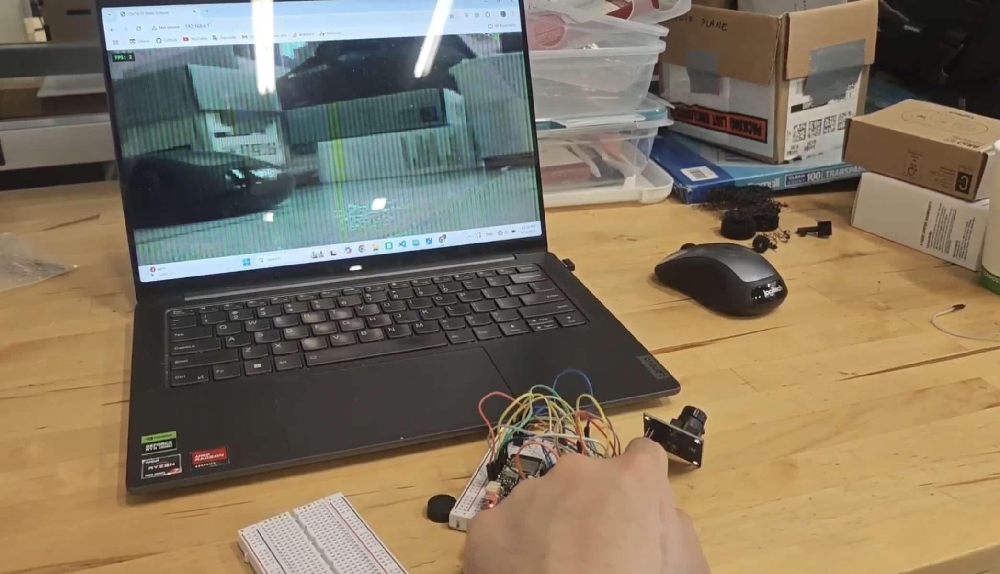

# OV7670-ESP32-CAM

This repository demonstrates how to use an ESP32 with the OV7670 camera **without FIFO**.

## Driver Installation
1. Clone or download this repository and locate the `driver/OV7670-ESP32` folder.  
2. Copy the entire `OV7670-ESP32` folder into your Arduino `libraries` directory.  
3. This driver is an updated version of the original [OV7670-ESP32 repo](https://github.com/kobatan/OV7670-ESP32) implementation, which is now deprecated. Improvements have been maade for compatibility, and ease of use.

## Usage Example

Navigate to the `esp_cam` directory and flash the provided code to your ESP32.
Adjust the pin configurations in the code to match your hardware setup.

### Features

- Streams OV7670 camera data over WebSocket.
- Displays the camera stream in a web page using a `<canvas>` element.
- The ESP32 acts as a Wi-Fi access point.
- Configured to output RGB565 format at QQVGA resolution (160x120).
- Allocates a frame buffer in the heap to store camera data.
- Broadcasts frame data to all connected WebSocket clients.
- Uses JavaScript on the web page to render the stream in real-time.

### Wiring (Camera → ESP32-Pico)

| Camera Pin | ESP32 Pin |
|------------|-----------|
| XCLK       | GPIO4     |
| SDA (SIOD) | GPIO21    |
| SCL (SIOC) | GPIO22    |
| D7 (Y9)    | GPIO27    |
| D6 (Y8)    | GPIO26    |
| D5 (Y7)    | GPIO25    |
| D4 (Y6)    | GPIO33    |
| D3 (Y5)    | GPIO32    |
| D2 (Y4)    | GPIO14    |
| D1 (Y3)    | GPIO34    |
| D0 (Y2)    | GPIO39    |
| VSYNC      | GPIO13    |
| HREF       | GPIO12    |
| PCLK       | GPIO5     |

### Web Page

The web page displays the camera stream and provides real-time FPS updates. It uses WebSocket to receive frame data and renders it on a `<canvas>` element.

### Notes

- The camera is configured for QQVGA resolution (160x120) by default.
- Ensure sufficient heap memory is available for the frame buffer.
- The WebSocket server broadcasts frame data to all connected clients.
- Buy a camera module with FIFO if you want to save yourself some headache.